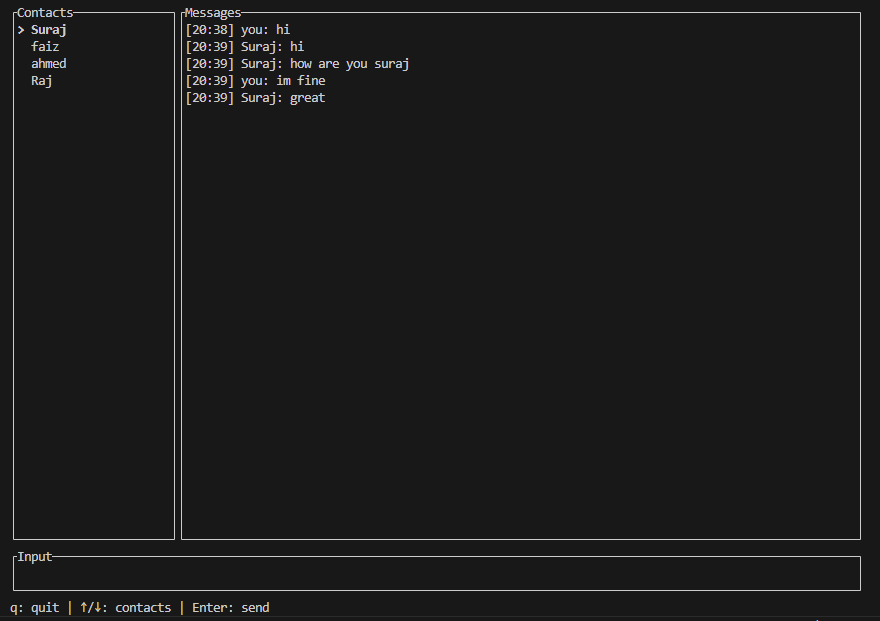

# CLD

> Secure terminal-based peer-to-peer messaging built in Rust.

[](#development)
[](https://www.rust-lang.org/)
[](#license)

CLD is a local-first terminal messenger for direct communication between trusted peers. It combines Rust async networking, end-to-end encrypted transport, SQLite-backed history, and a keyboard-driven TUI in a compact project.

## Features

- End-to-end encrypted peer-to-peer messaging
- X25519 + HKDF-SHA256 + ChaCha20Poly1305 crypto pipeline
- Fingerprint verification with TOFU fallback
- SQLite chat history
- Multi-peer terminal UI
- Configurable profiles with `--config`

## Quick Start

```bash
cargo run -- init
cargo run -- identity
cargo run -- add-peer friend 100.64.0.12:7799
cargo run -- tui
```

## Screenshots





## Documentation

- Setup and usage guide: [docs/getting-started.md](docs/getting-started.md)
- Architecture and project details: [docs/project-details.md](docs/project-details.md)

## Development

```bash
cargo fmt
cargo clippy
cargo test
cargo build
```

## License

MIT License placeholder.
